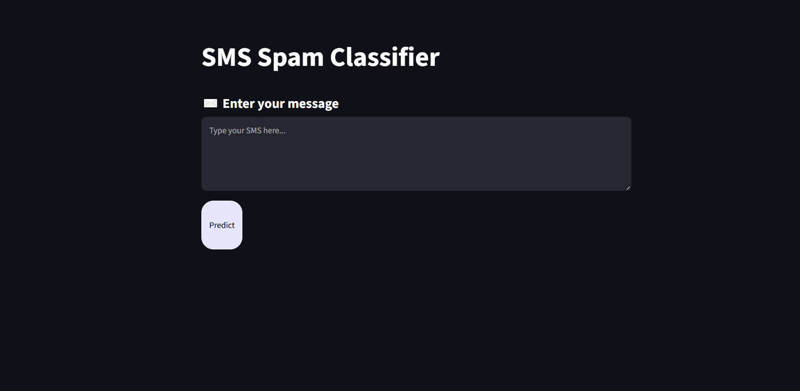
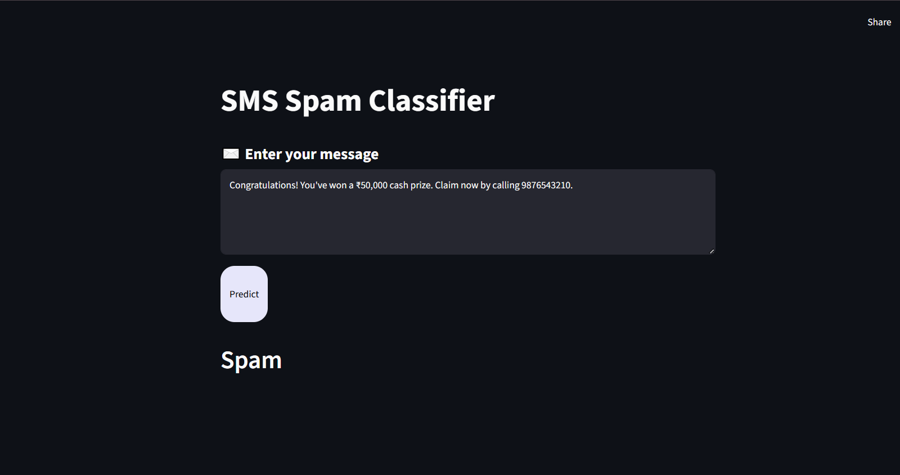

# SMS Spam Classifier
An **SMS Spam Classification System** built using **Machine Learning, Natural Language Processing (NLP), and Streamlit** that classifies incoming SMS messages as **Spam** or **Not Spam (Ham)** in real time.

## Live Demo

[](https://sms-spam-classifier-k4egrtua4xikiovwxxzzdf.streamlit.app/)
---

## Features

- Detect whether an SMS is Spam or Not Spam
- Real-time message classification
- Text preprocessing using NLP techniques
- TF-IDF Vectorization
- Machine Learning-based prediction
- Interactive Streamlit web interface
- Responsive and user-friendly design

---

## Tech Stack

- Python
- Pandas
- NumPy
- Scikit-Learn
- NLTK
- Streamlit
- Pickle

---

## Dataset

The dataset contains:
- SMS Text Messages
- Spam Messages
- Ham (Non-Spam) Messages

### Example

| Message | Label |
|----------|----------|
| Congratulations! You have won ₹50,000. Claim now! | Spam |
| Hey, are we meeting tomorrow? | Ham |

---

## Project Workflow

### 1. Data Collection
Collected the SMS Spam Collection Dataset.

### 2. Data Cleanin
- Removed unnecessary columns
- Handled missing values
- Removed duplicate messages

### 3. Text Preprocessing
- Converted text to lowercase
- Tokenization
- Removed punctuation
- Removed stopwords
- Applied stemming using Porter Stemmer

### 4. Feature Engineerin
Transformed text into numerical features using:
- TF-IDF Vectorization

### 5. Model Training
Trained and evaluated multiple machine learning algorithms:

- Multinomial Naive Bayes
- Support Vector Machine (SVM)
- Random Forest
- Decision Tree
- Extra Trees Classifier
- Ensemble Learning

### 6. Model Evaluation
Performance was evaluated using:
- Accuracy Score
- Precision Score

### 6. Model Selection
- Best performing model: Multinomial Naive Bayes with accuracy score 0.970986	 and Precision score 1.000000


### 7. Prediction System
The user enters an SMS message and the system predicts whether it is:
- Spam 🚨
- Not Spam 

### 8. Streamlit Web App Deployment
Deployed the application using Streamlit Community Cloud.

---

## Screenshots 📸

### Home Page



### Prediction Result



---

## Installation

### Clone Repository
```bash
git clone https://github.com/anjalikumari31-sudo/SMS-Spam-Classifier.git
```

### Move into Project Folder
```bash
cd SMS-Spam-Classifier
```

### Install Dependencies
```bash
pip install -r requirements.txt
```

### Run Application
```bash
streamlit run app.py
```

---
## Project Structure

```text
SMS-Spam-Classifier/
│
├── app.py
├── model.pkl
├── vectorizer.pkl
├── requirements.txt
├── .gitignore
└── README.md
```

---


---

## Acknowledgement

This project was developed as part of my learning journey in **Machine Learning, Natural Language Processing (NLP), and Web Application Deployment**.
This project helped me gain practical experience in:
- Data Cleaning and Preprocessing
- Natural Language Processing (NLP)
- Feature Extraction using TF-IDF
- Machine Learning Model Development
- Streamlit Application Development
- GitHub Version Control
- Cloud Deployment

---

## Author

**Anjali Kumari**


